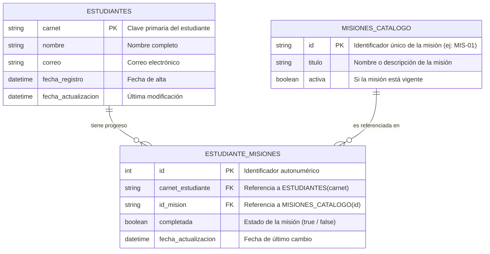

# API Maestro-Detalle — Registro y Progreso de Retos Estudiantiles

API REST construida en **Node.js** con patrón de arquitectura en capas (**Controller - Service - Repository**) para procesar solicitudes de registro y actualización en formato **JSON Maestro-Detalle** en un único endpoint `POST`.

---

## 1. Herramientas y Stack Tecnológico

### Backend (API REST)
| Categoría | Herramienta / Librería | Propósito |
| :--- | :--- | :--- |
| **Entorno de Ejecución** | [Node.js](https://nodejs.org/) (v18+ o v20+) | Plataforma base de ejecución JavaScript en el servidor. |
| **Framework Web** | [Express.js](https://expressjs.com/) | Enrutamiento ligero, manejo de middlewares y endpoints HTTP. |
| **Motor de Base de Datos** | PostgreSQL / MySQL / SQLite | Motor relacional para integridad referencial (claves foráneas) y transacciones ACID. |
| **Acceso a Datos / ORM** | Prisma / Sequelize o `pg` / `mysql2` | Consultas seguras, soporte de transacciones y operaciones *upsert*. |
| **Validación de Datos** | [Zod](https://zod.dev/) o [Joi](https://joi.dev/) | Validación rigurosa de esquema y tipos del payload JSON entrante. |
| **Configuración** | `dotenv` | Gestión segura de variables de entorno (puertos, credenciales de BD). |
| **Seguridad y Utilidades** | `cors`, `helmet`, `morgan` | Control de orígenes permitidos, cabeceras seguras y logs de peticiones HTTP. |
| **Desarrollo** | `nodemon` | Recarga automática del servidor durante el desarrollo local. |

### Frontend (Cliente Web SPA)
| Categoría | Herramienta / Librería | Propósito |
| :--- | :--- | :--- |
| **Framework UI** | [React](https://react.dev/) (v18+) | Biblioteca declarativa basada en componentes y hooks. |
| **Empaquetador y Build** | [Vite](https://vitejs.dev/) | Servidor de desarrollo ultrarrápido y compilador optimizado. |
| **Peticiones HTTP** | [Axios](https://axios-http.com/) o Fetch API | Cliente HTTP para consumir el endpoint `POST` y manejar estados de carga/error. |
| **Estilos** | CSS Moderno / Vanilla CSS / Tailwind | Diseño visual responsivo, tarjetas de misiones y feedback de estado. |
| **Iconografía** | Lucide React | Iconos para indicar estados de misiones, éxito, advertencias y carga. |

---

## 2. Estructura Global del Proyecto

```text
API Maestro-Detalle/
├── README.md                           # Documentación técnica completa
├── .env.example                        # Variables de entorno requeridas
├── package.json                        # Dependencias del servidor (Backend)
│
├── src/                                # === BACKEND (API Express) ===
│   ├── config/                         # Conexión a BD y configuración
│   │   └── database.js
│   ├── controllers/                    # Manejadores de rutas HTTP
│   │   └── studentMission.controller.js
│   ├── routes/                         # Definición de rutas (/api/v1/estudiantes/misiones)
│   │   └── studentMission.routes.js
│   ├── validators/                     # Validación de esquema JSON (Zod/Joi)
│   │   └── studentMission.validator.js
│   ├── services/                       # Lógica de negocio (Upsert y validación catálogo)
│   │   └── studentMission.service.js
│   ├── repositories/                   # Consultas a base de datos (Transacciones)
│   │   ├── student.repository.js
│   │   ├── mission.repository.js
│   │   └── studentMission.repository.js
│   ├── models/                         # Modelos o entidades relacionales
│   │   ├── student.model.js
│   │   ├── mission.model.js
│   │   └── studentMission.model.js
│   ├── middlewares/                    # Middlewares (errores y validadores)
│   │   ├── errorHandler.middleware.js
│   │   └── validateRequest.middleware.js
│   ├── database/                       # Migraciones y seeders de catálogo
│   │   ├── migrations/
│   │   └── seeders/
│   └── utils/                          # Respuestas estandarizadas y helpers
│       └── apiResponse.js
│
└── frontend/                           # === FRONTEND (React + Vite) ===
    ├── index.html                      # Punto de entrada HTML
    ├── package.json                    # Dependencias de React y Vite
    ├── vite.config.js                  # Configuración de Vite y proxy API
    ├── public/                         # Recursos estáticos públicos
    └── src/
        ├── assets/                     # Estilos globales, tipografías e imágenes
        ├── components/                 # Componentes modulares
        │   ├── common/                 # Botones, alertas, loaders, badges
        │   ├── master/                 # Formulario Estudiante (Carnet, Nombre, Correo)
        │   └── detail/                 # Lista y tarjetas de misiones (Checkboxes/Switch)
        ├── hooks/                      # Custom hooks (ej: useStudentMissions.js)
        ├── services/                   # Llamadas HTTP a la API (api.service.js)
        ├── context/                    # Estado global o notificaciones toast
        ├── pages/                      # Vista principal (StudentMissionsPage.jsx)
        └── utils/                      # Formateadores y validaciones de cliente
```

---

## 3. Arquitectura y Componentes del Frontend

### División de Responsabilidades
1. **Formulario Maestro (`components/master/StudentForm.jsx`)**:
   - Campos: `carnet` (clave única), `nombre`, `correo`.
   - Permite ingresar o editar los datos personales del estudiante.
2. **Lista Detalle (`components/detail/MissionsList.jsx` y `MissionCard.jsx`)**:
   - Presenta las misiones disponibles del catálogo.
   - Cada misión incluye su identificador (`idMision`), título y un control interactivo (toggle/checkbox) para marcar su estado (`completada: true / false`).
3. **Servicio API (`services/api.service.js`)**:
   - Función `sendStudentMissions(payload)` que despacha la petición `POST /api/v1/estudiantes/misiones`.
4. **Custom Hook (`hooks/useStudentMissions.js`)**:
   - Centraliza el estado del formulario maestro, la selección del detalle de misiones, estados de carga (`isLoading`), mensajes de éxito y captura de errores de referencia.
5. **Componentes Comunes (`components/common/`)**:
   - `Alert.jsx`: Muestra retroalimentación visual amigable si el carnet fue registrado/actualizado o si el catálogo rechazó algún ID.
   - `Button.jsx`: Botón de envío con estado de carga interactivo.

---

## 4. Modelo de Datos Relacional Sugerido



---

## 5. Flujo de Negocio del Endpoint

Cuando el frontend dispara el `POST` con el JSON Maestro-Detalle:

1. **Validación de Formato (`src/validators/`)**:
   - Comprueba que el JSON contenga la información requerida del estudiante (`carnet`, `nombre`, `correo`) y un arreglo `misiones` no vacío.
2. **Validación de Catálogo (`src/services/` + `src/repositories/`)**:
   - Extrae todos los `idMision` del detalle.
   - Consulta si todos esos IDs existen en la tabla `MISIONES_CATALOGO`.
   - **Si falta alguno**: Devuelve error **HTTP 422 / 400 (Error de Referencia)** indicando qué IDs no son válidos.
3. **Transacción en Base de Datos**:
   - **Upsert del Maestro (Estudiante)**:
     - Si el `carnet` no existe en la BD: ejecuta `INSERT`.
     - Si el `carnet` ya existe: ejecuta `UPDATE` con los nuevos datos.
   - **Upsert del Detalle (Misiones)**:
     - Para cada misión del estudiante, si ya existía en la relación, actualiza `completada` (`true`/`false`).
     - Si aún no estaba vinculada al estudiante, inserta el nuevo registro.
4. **Respuesta**:
   - Confirma la transacción con **Commit** y responde con **HTTP 200 / 201**.

---

## 6. Especificación del Payload (JSON)

### Petición: `POST /api/v1/estudiantes/misiones`

```json
{
  "estudiante": {
    "carnet": "2024-00123",
    "nombre": "Luis David",
    "correo": "luis.david@universidad.edu"
  },
  "misiones": [
    {
      "idMision": "MIS-01",
      "completada": true
    },
    {
      "idMision": "MIS-02",
      "completada": false
    },
    {
      "idMision": "MIS-05",
      "completada": true
    }
  ]
}
```

### Respuestas de la API

#### Éxito (HTTP 200 / 201)
```json
{
  "success": true,
  "message": "Datos de estudiante y misiones sincronizados exitosamente.",
  "data": {
    "carnet": "2024-00123",
    "operacionEstudiante": "ACTUALIZADO",
    "misionesProcesadas": 3
  }
}
```

#### Error de Referencia (HTTP 422 - ID de misión no existe en catálogo)
```json
{
  "success": false,
  "error": "Error de referencia en catálogo de misiones.",
  "detalles": {
    "misionesNoValidas": ["MIS-99"]
  }
}
```

---

## 7. Pasos para Iniciar el Proyecto

### Iniciar Backend
```bash
# En la raíz del proyecto:
npm init -y
npm install express dotenv cors zod
npm install -D nodemon
```

### Iniciar Frontend
```bash
# Dentro de la carpeta frontend:
cd frontend
npm create vite@latest . -- --template react
npm install
npm install lucide-react
npm run dev
```

